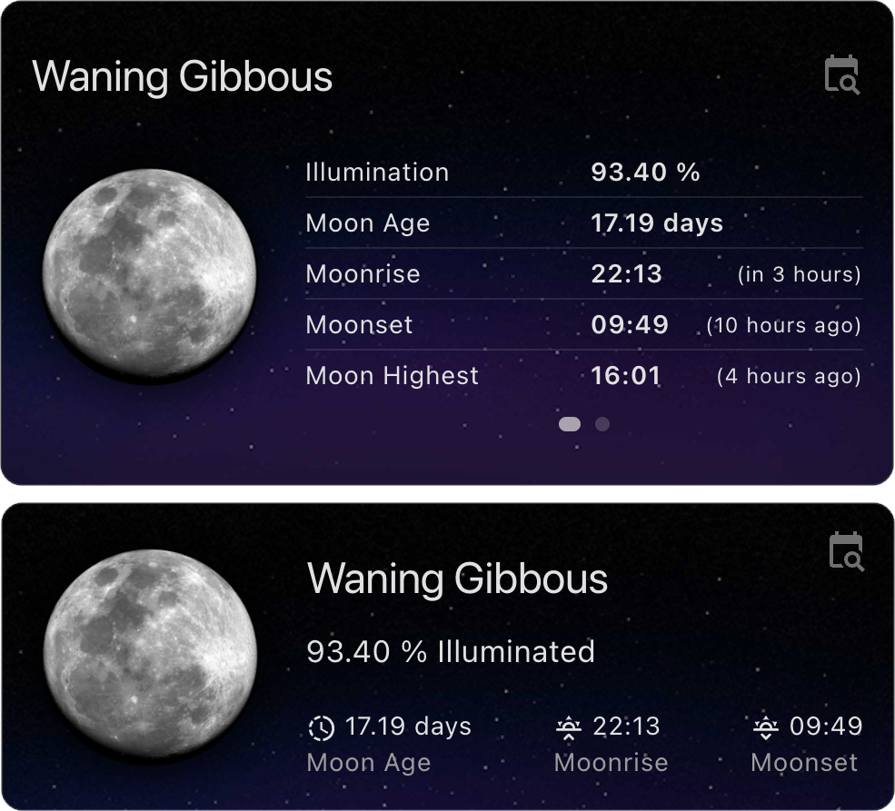

# 🌘 Lunar Phase Card

This is a Lovelace custom card for Home Assistant that provides detailed information about the current phase of the moon. This card leverages precise astronomical calculations to deliver accurate lunar data, making it a valuable addition for those interested in astronomy, astrology, or just tracking the moon's phases.

## Features

- **Current Lunar Phase Display:** Shows the current phase of the moon.
- **Detailed Lunar Information:** Provides additional details about the lunar cycle.
- **Customizable:** Easily customizable to fit your dashboard's theme.
- **Responsive Design:** Works well on both desktop and mobile devices.
- **Lightweight:** Optimized for performance with minimal impact on your Home Assistant setup.
- **Custom Latitude and Longitude Configuration:** Offers the possibility to configure custom latitude and longitude for precise lunar data.
- **Specific Date Lunar Information:** Option to display the moon information for a specific date.

### Screenshots

  
Default & Compact view

  
Calendar Options

